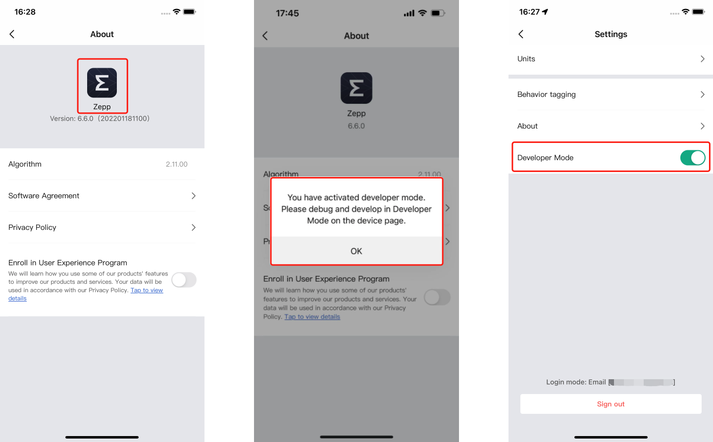
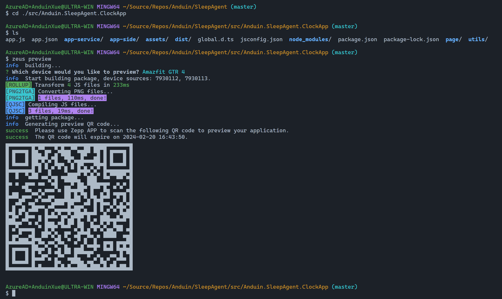
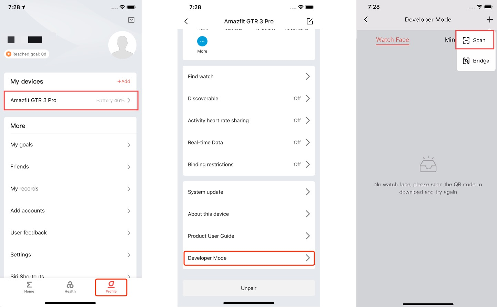
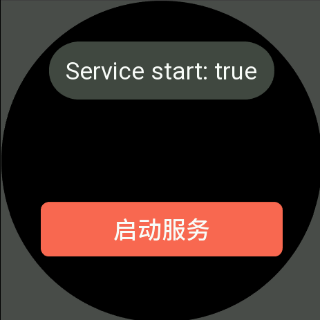

# Sleep Agent

[](https://gitlab.aiursoft.cn/anduin/sleepAgent/-/blob/master/LICENSE)
[](https://gitlab.aiursoft.cn/anduin/sleepAgent/-/pipelines)
[](https://gitlab.aiursoft.cn/anduin/SleepAgent/-/pipelines)
[](https://gitlab.aiursoft.cn/anduin/sleepAgent/-/commits/master?ref_type=heads)
[](https://hub.aiursoft.cn/#!/taglist/anduin/sleepagent)

Smart wristbands are basic electronic products that many people own nowadays. They have a wide variety of sensors that can collect a large amount of interesting data, such as sleep patterns, physical activity, and cardiovascular health. This data often has high analytical and development value.

For example, you can automatically activate the "do not disturb" mode on your phone after falling asleep and turn it off when you wake up. Or you can monitor your heart rate changes to control a treadmill for steady-state running. Or you can monitor blood oxygen saturation and send an alert when abnormalities occur.

So, it is very necessary to expand your smart wristband. And this repository provides a solution:

It supports the Amazfit GTR 4 wristband, running a background service in the wristband that scans the data of various sensors every 5 minutes and sends it to a custom HTTP server. Similarly, this repository also provides the HTTP data cache server.

Using this solution, you can perfectly retrieve your health data using HTTP API, use it for further expansion and development, or export it to Prometheus.

# Server side

## Run in Ubuntu

The following script will install\update this app on your Ubuntu server. Supports Ubuntu 22.04.

On your Ubuntu server, run the following command:

```bash
curl -sL https://gitlab.aiursoft.cn/anduin/sleepagent/-/raw/master/install.sh | sudo bash
```

Of course it is suggested that append a custom port number to the command:

```bash
curl -sL https://gitlab.aiursoft.cn/anduin/sleepagent/-/raw/master/install.sh | sudo bash -s 8080
```

It will install the app as a systemd service, and start it automatically. Binary files will be located at `/opt/apps`. Service files will be located at `/etc/systemd/system`.

## Run manually

Requirements about how to run

1. Install [.NET 7 SDK](http://dot.net/) and [Node.js](https://nodejs.org/).
2. Execute `npm install` at `wwwroot` folder to install the dependencies.
3. Execute `dotnet run` to run the app.
4. Use your browser to view [http://localhost:5000](http://localhost:5000).

## Run in Microsoft Visual Studio

1. Open the `.sln` file in the project path.
2. Press `F5` to run the app.

## Run in Docker

First, install Docker [here](https://docs.docker.com/get-docker/).

Then run the following commands in a Linux shell:

```bash
image=hub.aiursoft.cn/anduin/sleepAgent
appName=sleepAgent
docker pull $image
docker run -d --name $appName --restart unless-stopped -p 5000:5000 -v /var/www/$appName:/data $image
```

That will start a web server at `http://localhost:5000` and you can test the app.

The docker image has the following context:

| Properties  | Value                            |
|-------------|----------------------------------|
| Image       | hub.aiursoft.cn/anduin/sleepAgent|
| Ports       | 5000                             |
| Binary path | /app                             |
| Data path   | /data                            |
| Config path | /data/appsettings.json           |

# Sleep Agent full deployment

## Step 1 - Buy an Amazfit GTR 4

Of course you need to own a ZEPP watch to use this solution. Please buy the Amazfit GTR 4.

[京东](https://item.jd.com/100037094209.html)

Costs around 1000 RMB.

## Step 2 - Enable the developer mode

You need to enable the developer mode on your watch.

Go to `Settings` -> `About`, then tap the logo 10 times.



Now you can see the developer mode.

## Step 3 - Deploy the server

Of course, you need to deploy the server to store the sleep data.

Buy or deploy a Ubuntu 22.04 server. Deploy with any approaches above.

* Deploy with a single script
* Deploy manually
* Deploy with Docker

And get the server's endpoint. For example, `http://your-server.com`.

This will be the endpoint that the app will send the sleep data to.

## Step 4 - Build the app

You need to edit, build the app and install it on your phone.

First, install Node.js and NPM on your computer.

```bash
# Assuming you are using Windows
winget install -e --id Node.js.Node.js
```

Then, install the ZEUS CLI tool:

```bash
npm i @zeppos/zeus-cli -g
```

Now change the endpoint to your own server's endpoint in the `./src/Anduin.SleepAgent.ClockApp/app-service/background_service.js` file.

```typescript
const endPoint = "http://your-server.com/api/metrics/send"
```

The app will send the sleep data to this endpoint.

Now, build the app:

```bash
cd ./src/Anduin.SleepAgent.ClockApp
zeus preview
```

Now you will see a QR code.



## Step 5 - Install the app

Open the ZEPP app on your phone, and scan the QR code.



Now you can see the app on your watch's app list.

## Step 6 - Configure the app

Open the app on your watch, click the start button, and the app will start to send the sleep data to your server.



## Step 7 - View the data

Wait 5-10 minutes, and you can view the metrics data on your server.

Open your browser and navigate to `http://your-server.com/api/metrics/all`.

You will see the users list which has sent the sleep data to your server.

```json
[
"SomeUser",
"SomeOtherUser"
]
```

To view one user's data, navigate to `http://your-server.com/api/metrics/query?nick-name=SomeUser`.

You may see:

```json
// View https://docs.zepp.com/docs/reference/device-app-api/newAPI/sensor/Sleep/ for more information
{
    "user": {
        "age": 30,
        "height": 1.80, // Meters
        "weight": 75.0, // KG
        "gender": 0, // 0 is male, 1 is female
        "nickName": "UserName",
        "region": "cn",
        "birth": {
            "year": 1990,
            "month": 1,
            "day": 1
        }
    },
    "device": {
        "width": 466,
        "height": 466,
        "screenShape": 1,
        "deviceName": "Amazfit GTR 4",
        "keyNumber": 2,
        "keyType": "normal_21",
        "deviceSource": 7930222,
        "deviceColor": 3,
        "productId": 121,
        "productVer": 256,
        "skuId": 256
    },
    "heartRateLast": 85, // BPM
    "heartRateResting": 65, // BPM
    "heartRateSummary": {
        "maximum": {
            "time": 1708437033, // Unix timestamp
            "time_zone": 0, // GMT+0
            "hr_value": 154 // BPM
        }
    },
    "battery": 99, // Percentage
    "bloodOxygen": {
        "value": 97, // Percentage
        "time": 1708433574, // Unix timestamp
        "retCode": 2 // 2: Success, other: Failed
    },
    "bloodOxygenLastFewHour": [],
    "calorie": 247, // Kcal
    "calorieT": 800, // Kcal
    "distance": 3391, // Meters
    "fatBurning": 39,
    "fatBurningT": 30,
    "paiDay": 2,
    "paiWeek": 155,
    "sleepInfo": {
        "score": 93,
        "startTime": 1186, // Minutes from 00:00
        "endTime": 1648, // Minutes from 00:00
        "deepTime": 103, // Minutes
        "totalTime": 463 // Minutes
    },
    "sleepStgList": {
        "WAKE_STAGE": 7,
        "REM_STAGE": 8,
        "LIGHT_STAGE": 4,
        "DEEP_STAGE": 5
    },
    "SleepingStatus": 0, // 0: Awake, 1: Sleeping
    "stands": 5, // Times
    "standsT": 12, // Times
    "steps": 4461, // Steps
    "stepsT": 6000, // Steps
    "stress": {
        "value": 49,
        "time": 1708439460
    },
    "isWearing": 1 // 0: not wearing, 1: wearing, 2: in motion, 3: not sure
}
```

Now you can save the JSON or teleport it to other monitoring systems like Prometheus or Grafana.

## How to contribute

There are many ways to contribute to the project: logging bugs, submitting pull requests, reporting issues, and creating suggestions.

Even if you with push rights on the repository, you should create a personal fork and create feature branches there when you need them. This keeps the main repository clean and your workflow cruft out of sight.

We're also interested in your feedback on the future of this project. You can submit a suggestion or feature request through the issue tracker. To make this process more effective, we're asking that these include more information to help define them more clearly.
